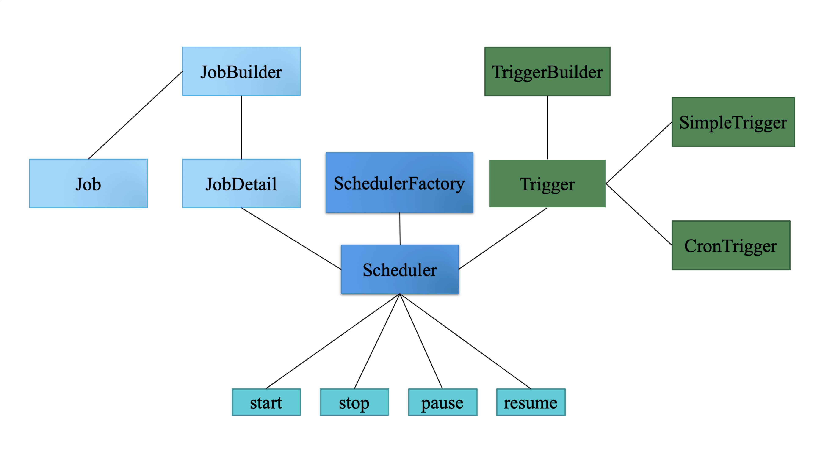

# Quartz

Quartz是一个功能丰富的开源作业调度库，可以集成到几乎任何Java应用程序中 - 从最小的独立应用程序到最大的电子商务系统。quartz可用于创建执行数十，数百甚至数十万个作业的简单或复杂的计划; 任务定义为标准Java组件的任务，可以执行任何可以对其进行编程的任何内容。Quartz Scheduler包含许多企业级功能，例如支持JTA事务和集群。

> Quartz is a richly featured, open source job scheduling library that can be integrated within virtually any Java application - from the smallest stand-alone application to the largest e-commerce system. Quartz can be used to create simple or complex schedules for executing tens, hundreds, or even tens-of-thousands of jobs; jobs whose tasks are defined as standard Java components that may execute virtually anything you may program them to do. The Quartz Scheduler includes many enterprise-class features, such as support for JTA transactions and clustering.

1. 允许我们灵活而细粒度地设置任务触发时间，比如常见的每隔多长时间，或每天特定时刻、特定日子（如节假日），都能灵活地配置这些成相应时间点来触发我们的任务
2. 提供了调度环境的持久化机制，可以将任务内容保存到数据库中，在完成后删除记录，这样就能避免因系统故障而任务尚未执行且不再执行的问题。
3. 提供了组件式的侦听器、各种插件、线程池等。通过侦听器，我们可以引入我们的事件机制，配合上异步调用，既能为我们的业务处理类解耦，同时还可能提升用户体验

```
Job - 定义作业的接口
JobDetail - 存储Job实例的状态信息
JobBuilder - 接受Job实现类，生成JobDetail实例
Trigger - 触发器，定义触发的条件
TriggerBuilder - 用于构建Trigger实例
Scheduler - 任务调度器，所有的调度都是由它控制
SchedulerFactory – 用于创建Scheduler的工厂类
```




### Job

Job只有一个execute(JobExecutionContext)，JobExecutionContext保存了job的上下文信息，比如绑定的是哪个Trigger。Job实现类必须实现execute()，执行job实际上就是运行execute()。

Job实例在Quartz中的生命周期：每次调度器执行Job时都会创建一个新的job实例，在调用后会被释放。

### JobDetail

JobDetail为Job实例提供了许多设置属性，用来存储特定job实例的状态信息，调度器需要借助JobDetail对象来添加Job实例。

JobDataMap包含了序列化的数据对象，在job实例执行时可以使用其中的数据。JobDataMap也存储在JobExecutionContext中。

### Trigger

- Trigger的公共属性
    - jobKey
    - startTime
    - endTime
- 优先级(priority)
- 错过触发(misfire Instructions)
- 日历 (calendar)

**jobdetail可以对应多个trigger，但是一个trigger只能对应一个job**

### Trigger的几种实现

- SimpleTrigger
- CalendarIntervalTrigger
- DailyTimeIntervalTrigger
- CronTrigger

### CronTrigger

使用CronTrigger，可以指定时间表，例如“每周五中午”或“每个工作日上午9:30”，甚至“每周一至周五上午9:00至10点之间每5分钟”和“1月份的星期五”。

### Cron表达式

Cron表达式由6或7个空格分割的时间字段组成

| 位置 | 时间 | 允许值 | 允许的特殊字符 |
| --- | --- | --- | --- |
| 1 | 秒 | 0-59 | , - * / |
| 2 | 分 | 0-59 | , - * / |
| 3 | 时 | 0-23 | , - * / |
| 4 | 日期 | 1-31 | , - * ? / L W |
| 5 | 月份 | 1-12 or JAN-DEC | , - * / |
| 6 | 星期 | 1-7 or SUN-SAT | , - * ? / L # |
| 7 | 年(可选) | empty, 1970-2099 | , - * / |

| 特殊字符 | 意义 |
| --- | --- |
| 星号(*) | 可用在所有字段下，表示对应时间域名的每一个时刻，如*用在分钟字段，表示“每分钟”。 |
| 问号(?) | 只能用在日期和星期字段，代表无意义的值，比如使用L设定为当月的最后一天，则配置日期配置就没有意义了，可用？作占位符的作用。 | 
| 减号(-) | 表示一个范围，如在日期字段5-10，表示从五号到10号，相当于使用逗号的5,6,7,8,9,10 | 
| 逗号(,) | 表示一个并列有效值，比如在月份字段使用JAN,DEC表示1月和12月 |
|  斜杠(/) | x/y表示一个等步长序列，x为起始值，y为增量步长值，如在小时使用1/3相当于1,4,7,10当时用*/y时，相当于0/y |
| L | L(Last)只能在日期和星期字段使用，但意思不同。在日期字段，表示当月最后一天，在星期字段，表示星期六（如果按星期天为一星期的第一天的概念，星期六就是最后一天。如果L在星期字段，且前面有一个整数值X，表示“这个月的最后一个星期X”，比如3L表示某个月的最后一个星期二 |
| W | 选择离给定日期最近的工作日（周一至周五）。例如你指定“15W”作为day of month字段的值，就意味着“每个月与15号最近的工作日”。所以，如果15号是周六，则触发器会在14号（周五）触发。如果15号是周日，则触发器会在16号（周一）触发。如果15号是周二，则触发器会在15号（周二）触发。但是，如果你指定“1W”作为day of month字段的值，且1号是周六，则触发器会在3号（周一）触发。quartz不会“跳出”月份的界限。 | 
| LW | 在日期字段可以组合使用LW,表示当月最后一个工作日（周一至周五） |
| 井号(#) | 只能在星期字段中使用指定每月第几个星期X。例如day of week字段的“6＃3”，就意味着“每月第3个星期五”（day3=星期五，＃3=第三个）；“2＃1”就意味着“每月第1个星期一”；“4＃5”就意味着“每月第5个星期3。需要注意的是“＃5”，如果在当月没有第5个星期三，则触发器不会触发。 |

生成cron表达式的网站: www.freeformatter.com/cron-expression-generator-quartz.html

### Scheduler

- Scheduler就是Quartz的大脑，所有任务都由它来设施。
- Schduelr包含两个重要组件: JobStore和ThreadPool。
- JobStore用来存储运行时信息，包括Trigger 、 Schduler 、 JobDetail 、业务锁等。它有多种实现RAMJob(内存实现)，JobStoreTX(JDBC，事务由Quartz管理）、JobStoreCMT(JDBC，使用容器事务)，ClusteredJobStore(集群实现)、TerracottaJobStore。
- ThreadPool就是线程池，Quartz有自己的线程池实现。所有任务的都会由线程池执行。

### 示例

```Java
public class QuartzTest {
    public static void main(String[] args) throws SchedulerException, InterruptedException {
        // 创建调度器
        SchedulerFactory schedulerFactory = new StdSchedulerFactory();
        Scheduler scheduler = schedulerFactory.getScheduler();

        // 创建任务
        JobDetail jobDetail = JobBuilder.newJob(JobImpl.class).withIdentity("myJob", "jobGroup").build();

        // 创建触发器
        // 每隔1s执行任务
        Date triggerDate = new Date();
        SimpleScheduleBuilder schedBuilder = SimpleScheduleBuilder.simpleSchedule().withIntervalInSeconds(1).repeatForever();
        TriggerBuilder<Trigger> triggerBuilder  = TriggerBuilder.newTrigger().withIdentity("myTrigger", "triggerGroup");
        Trigger trigger = triggerBuilder.startAt(triggerDate).withSchedule(schedBuilder).build();

        // 将任务及其触发器放入调度器
        scheduler.scheduleJob(jobDetail, trigger);

        // 调度器开始调度任务
        scheduler.start();
    }

    public static class JobImpl implements Job {
        @Override
        public void execute(JobExecutionContext jobExecutionContext) throws JobExecutionException {
            System.out.println("job start");
            // TODO
            System.out.println("job end");
        }
    }
}
```

### Listeners

当任务调度中关注的事件发生时，监听器能够及时获取这一事件的通知。类似于任务执行过程中的邮件、短信类的提醒。

Quartz的监听器分为TriggerListeners、JobListeners、SchedulerListeners三种，分别对应Trigger、Job、Scheduler的监听。


### Clustering

Clustering目前与JDBC-Jobstore（JobStoreTX或JobStoreCMT）和TerracottaJobStore一起使用。

功能包括负载平衡和 job故障转移（如果JobDetail的“请求恢复”标志设置为true）。

### 插件

Quartz提供了一个用于插入附加功能的接口（org.quartz.spi.SchedulerPlugin）。

与Quartz一起提供各种实用功能的插件可以在org.quartz.plugins 包中找到。它们提供诸如在调度程序启动时自动调度jobs的功能，记录jobs和触发事件的历史记录，并确保当JVM退出时，调度程序将彻底关闭。

### 线程模型

- SimpleThreadPool
- WorkerThread
- QuartzSchedulerThread


---

### 参考

http://www.quartz-scheduler.org/
https://github.com/quartz-scheduler/quartz
https://www.w3cschool.cn/quartz_doc/
https://blog.csdn.net/qwe6112071/article/details/70844587
https://www.jianshu.com/p/bab8e4e32952
http://royliu.me/2017/09/09/quartz2-x-code-anylse-runEngine-threadModel/
